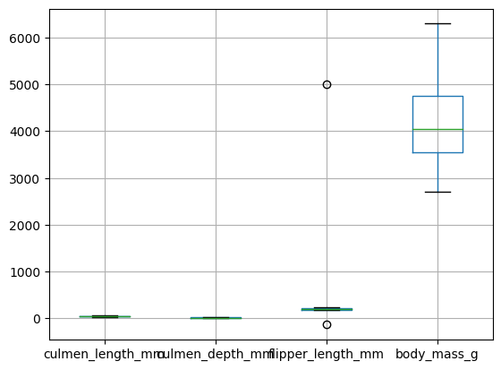
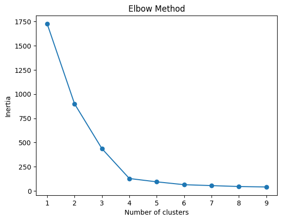
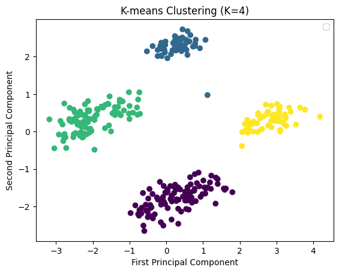

# Clustering Penguins Species

Utilize Unsupervised learning skills to reduce dimensionality and identify clusters in the penguins dataset


**The dataset consists of 5 columns**

- culmen_length_mm: culmen length (mm)
- culmen_depth_mm: culmen depth (mm)
- flipper_length_mm: flipper length (mm)
- body_mass_g: body mass (g)
- sex: penguin sex


## Import Packages


```python
# Import Required Packages
import pandas as pd
import matplotlib.pyplot as plt
from sklearn.decomposition import PCA
from sklearn.cluster import KMeans
from sklearn.preprocessing import StandardScaler
import warnings
warnings.filterwarnings("ignore", category=FutureWarning)
```

## Load Dataset


```python
# Loading and examining the dataset
penguins_df = pd.read_csv("dataset/penguins.csv")
penguins_df.head()
```


<div>
<table border="1" class="dataframe">
  <thead>
    <tr style="text-align: right;">
      <th></th>
      <th>culmen_length_mm</th>
      <th>culmen_depth_mm</th>
      <th>flipper_length_mm</th>
      <th>body_mass_g</th>
      <th>sex</th>
    </tr>
  </thead>
  <tbody>
    <tr>
      <th>0</th>
      <td>39.1</td>
      <td>18.7</td>
      <td>181.0</td>
      <td>3750.0</td>
      <td>MALE</td>
    </tr>
    <tr>
      <th>1</th>
      <td>39.5</td>
      <td>17.4</td>
      <td>186.0</td>
      <td>3800.0</td>
      <td>FEMALE</td>
    </tr>
    <tr>
      <th>2</th>
      <td>40.3</td>
      <td>18.0</td>
      <td>195.0</td>
      <td>3250.0</td>
      <td>FEMALE</td>
    </tr>
    <tr>
      <th>3</th>
      <td>NaN</td>
      <td>NaN</td>
      <td>NaN</td>
      <td>NaN</td>
      <td>NaN</td>
    </tr>
    <tr>
      <th>4</th>
      <td>36.7</td>
      <td>19.3</td>
      <td>193.0</td>
      <td>3450.0</td>
      <td>FEMALE</td>
    </tr>
  </tbody>
</table>
</div>


## Dealing with null values and outliers


```python
penguins_df.boxplot()
plt.show()
penguins_df = penguins_df.dropna()
penguins_df[penguins_df["flipper_length_mm"] > 4000]
penguins_df[penguins_df["flipper_length_mm"] < 0]
penguins_clean = penguins_df.drop([9, 14])
penguins_clean.head()
```


    

    


<div>
<table border="1" class="dataframe">
  <thead>
    <tr style="text-align: right;">
      <th></th>
      <th>culmen_length_mm</th>
      <th>culmen_depth_mm</th>
      <th>flipper_length_mm</th>
      <th>body_mass_g</th>
      <th>sex</th>
    </tr>
  </thead>
  <tbody>
    <tr>
      <th>0</th>
      <td>39.1</td>
      <td>18.7</td>
      <td>181.0</td>
      <td>3750.0</td>
      <td>MALE</td>
    </tr>
    <tr>
      <th>1</th>
      <td>39.5</td>
      <td>17.4</td>
      <td>186.0</td>
      <td>3800.0</td>
      <td>FEMALE</td>
    </tr>
    <tr>
      <th>2</th>
      <td>40.3</td>
      <td>18.0</td>
      <td>195.0</td>
      <td>3250.0</td>
      <td>FEMALE</td>
    </tr>
    <tr>
      <th>4</th>
      <td>36.7</td>
      <td>19.3</td>
      <td>193.0</td>
      <td>3450.0</td>
      <td>FEMALE</td>
    </tr>
    <tr>
      <th>5</th>
      <td>39.3</td>
      <td>20.6</td>
      <td>190.0</td>
      <td>3650.0</td>
      <td>MALE</td>
    </tr>
  </tbody>
</table>
</div>


## Perform preprocessing steps on the dataset to create dummy variables


```python
df = pd.get_dummies(penguins_clean).drop("sex_.", axis=1)
df.head()
```


<div>
<table border="1" class="dataframe">
  <thead>
    <tr style="text-align: right;">
      <th></th>
      <th>culmen_length_mm</th>
      <th>culmen_depth_mm</th>
      <th>flipper_length_mm</th>
      <th>body_mass_g</th>
      <th>sex_FEMALE</th>
      <th>sex_MALE</th>
    </tr>
  </thead>
  <tbody>
    <tr>
      <th>0</th>
      <td>39.1</td>
      <td>18.7</td>
      <td>181.0</td>
      <td>3750.0</td>
      <td>False</td>
      <td>True</td>
    </tr>
    <tr>
      <th>1</th>
      <td>39.5</td>
      <td>17.4</td>
      <td>186.0</td>
      <td>3800.0</td>
      <td>True</td>
      <td>False</td>
    </tr>
    <tr>
      <th>2</th>
      <td>40.3</td>
      <td>18.0</td>
      <td>195.0</td>
      <td>3250.0</td>
      <td>True</td>
      <td>False</td>
    </tr>
    <tr>
      <th>4</th>
      <td>36.7</td>
      <td>19.3</td>
      <td>193.0</td>
      <td>3450.0</td>
      <td>True</td>
      <td>False</td>
    </tr>
    <tr>
      <th>5</th>
      <td>39.3</td>
      <td>20.6</td>
      <td>190.0</td>
      <td>3650.0</td>
      <td>False</td>
      <td>True</td>
    </tr>
  </tbody>
</table>
</div>


## Perform preprocessing steps on the dataset - scaling


```python
scaler = StandardScaler()
X = scaler.fit_transform(df)
penguins_preprocessed = pd.DataFrame(data=X, columns=df.columns)
penguins_preprocessed.head(10)
```


<div>
<table border="1" class="dataframe">
  <thead>
    <tr style="text-align: right;">
      <th></th>
      <th>culmen_length_mm</th>
      <th>culmen_depth_mm</th>
      <th>flipper_length_mm</th>
      <th>body_mass_g</th>
      <th>sex_FEMALE</th>
      <th>sex_MALE</th>
    </tr>
  </thead>
  <tbody>
    <tr>
      <th>0</th>
      <td>-0.905520</td>
      <td>0.793126</td>
      <td>-1.428125</td>
      <td>-0.569709</td>
      <td>-0.991031</td>
      <td>0.997001</td>
    </tr>
    <tr>
      <th>1</th>
      <td>-0.831938</td>
      <td>0.128503</td>
      <td>-1.071522</td>
      <td>-0.507579</td>
      <td>1.009050</td>
      <td>-1.003008</td>
    </tr>
    <tr>
      <th>2</th>
      <td>-0.684775</td>
      <td>0.435252</td>
      <td>-0.429637</td>
      <td>-1.191006</td>
      <td>1.009050</td>
      <td>-1.003008</td>
    </tr>
    <tr>
      <th>3</th>
      <td>-1.347011</td>
      <td>1.099875</td>
      <td>-0.572278</td>
      <td>-0.942487</td>
      <td>1.009050</td>
      <td>-1.003008</td>
    </tr>
    <tr>
      <th>4</th>
      <td>-0.868729</td>
      <td>1.764498</td>
      <td>-0.786240</td>
      <td>-0.693968</td>
      <td>-0.991031</td>
      <td>0.997001</td>
    </tr>
    <tr>
      <th>5</th>
      <td>-0.942311</td>
      <td>0.333002</td>
      <td>-1.428125</td>
      <td>-0.725033</td>
      <td>1.009050</td>
      <td>-1.003008</td>
    </tr>
    <tr>
      <th>6</th>
      <td>-0.887125</td>
      <td>1.253249</td>
      <td>-0.429637</td>
      <td>0.579691</td>
      <td>-0.991031</td>
      <td>0.997001</td>
    </tr>
    <tr>
      <th>7</th>
      <td>-0.537611</td>
      <td>0.230753</td>
      <td>-1.356804</td>
      <td>-1.253136</td>
      <td>1.009050</td>
      <td>-1.003008</td>
    </tr>
    <tr>
      <th>8</th>
      <td>-0.997497</td>
      <td>2.071247</td>
      <td>-0.714919</td>
      <td>-0.507579</td>
      <td>-0.991031</td>
      <td>0.997001</td>
    </tr>
    <tr>
      <th>9</th>
      <td>-1.365406</td>
      <td>0.333002</td>
      <td>-1.142843</td>
      <td>-0.631839</td>
      <td>1.009050</td>
      <td>-1.003008</td>
    </tr>
  </tbody>
</table>
</div>


## Perform PCA


```python
pca = PCA(n_components=None)
dfx_pca = pca.fit(penguins_preprocessed)
dfx_pca.explained_variance_ratio_
n_components = sum(dfx_pca.explained_variance_ratio_ > 0.1)
pca = PCA(n_components=n_components)
penguins_PCA = pca.fit_transform(penguins_preprocessed)
print(n_components)
```

    2


## Detect the optimal number of clusters for k-means clustering


```python
inertia = []
for k in range(1, 10):
    kmeans = KMeans(n_clusters=k, random_state=42).fit(penguins_PCA)
    inertia.append(kmeans.inertia_)
plt.plot(range(1, 10), inertia, marker="o")
plt.xlabel("Number of clusters")
plt.ylabel("Inertia")
plt.title("Elbow Method")
plt.show()
n_clusters = 4
```


    

    


## Run the k-means clustering algorithm


```python
kmeans = KMeans(n_clusters=n_clusters, random_state=42).fit(penguins_PCA)
plt.scatter(penguins_PCA[:, 0], penguins_PCA[:, 1], c=kmeans.labels_, cmap="viridis")
plt.xlabel("First Principal Component")
plt.ylabel("Second Principal Component")
plt.title(f"K-means Clustering (K={n_clusters})")
plt.legend()
plt.show()
```


    

    

